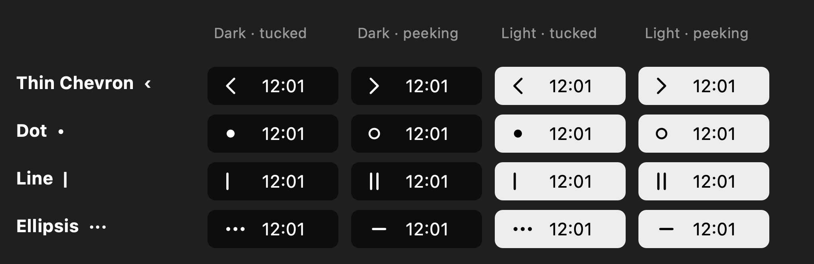
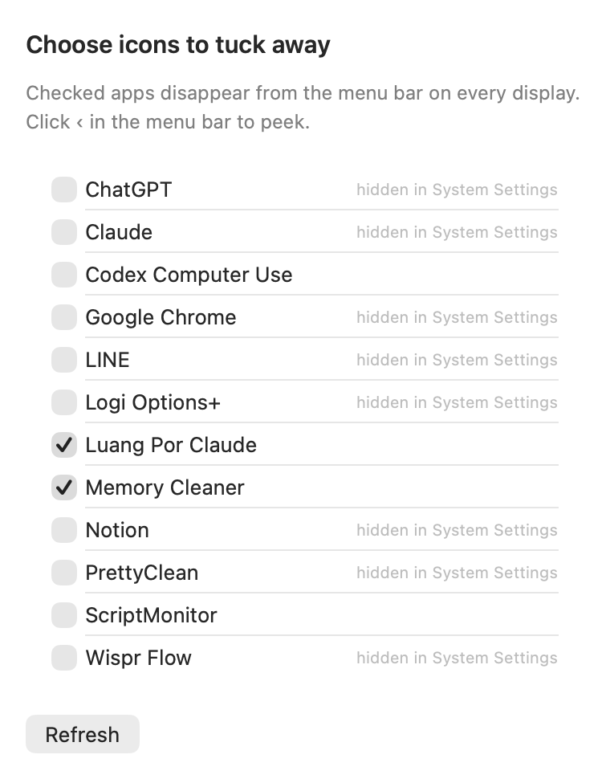

# Tuck

**Hide menu bar icons on macOS 26 Tahoe and macOS 27, the way Apple does it, with a one-click peek.**

[](https://ko-fi.com/champktp)
[](../../releases/latest)


Tuck is a tiny (600 KB) native menu bar utility. Pick the apps whose icons you
want out of the way; they vanish from the menu bar on every display, with no
overflow `«` button and no gaps. Click Tuck's dot to peek at them, and they tuck
themselves away again after a delay you choose.

<p align="center">
  
</p>

## Why another menu bar hider?

Hidden Bar, Dozer, Vanilla and friends hid icons by making an invisible status
item thousands of points wide so everything to its left was pushed off screen.
macOS 26 rebuilt the menu bar: Control Center now composites it, **drops any
item that does not fit**, and shows a `«` button to reach the dropped items.
The giant invisible item is dropped itself, so those apps hide nothing, and
every width-based trick ends with a `«` on screen, recomputed per display.

macOS 26 also added the clean way: the per-app switches under
**System Settings → Menu Bar**. Flipping one removes the icon outright, it
applies immediately to a running app, it is identical on every display, and
macOS remembers it across restarts. Tuck flips those switches for you through
the Accessibility API, and adds the "peek" that Hidden Bar users miss.

## Features

- **Tuck away any third-party menu bar app** listed in System Settings → Menu Bar.
- **Peek**: one click shows the tucked icons; they hide again after 5 s … 5 min, or never.
- **Clean on every display.** No `«`, no blank space, no per-display setup.
- **Instant.** A peek or hide takes about 50–100 ms.
- **Four icon styles**: thin chevron, dot, line, ellipsis. Template images, so they match light and dark menu bars.
- **Launch at Login**, scriptable via signals, no background timers, 0 % idle CPU.
- Pure Swift, Apple frameworks only, builds with the Command Line Tools.

<p align="center">
  
</p>

## Requirements

- macOS 14 or later to run; the hiding mechanism exists on **macOS 26 and later**.
- Apple silicon (the release build is arm64; build from source for Intel).
- Accessibility access for Tuck (asked on first launch).

## Install

1. Download `Tuck-x.y.dmg` from the [Releases](../../releases) page, open it,
   and drag `Tuck.app` onto the `Applications` folder (a `.zip` of the app is
   attached as well).
2. Eject the disk image.
3. The app is not notarized. On first launch macOS will refuse to open it:
   right-click `Tuck.app` → **Open** → **Open**, or run

       xattr -d com.apple.quarantine /Applications/Tuck.app

4. Open Tuck. When asked, turn on Tuck under
   **System Settings → Privacy & Security → Accessibility**.
5. Tick the apps you want tucked away in the window that appears.

## Using Tuck

| Action | How |
|---|---|
| Peek / hide | Click the Tuck icon |
| Choose which icons are tucked | Right-click → **Choose Icons to Tuck…** |
| Change the hide delay | Right-click → **Hide Again After** |
| Change the icon | Right-click → **Icon Style** |
| Start with macOS | Right-click → **Launch at Login** |

New menu bar apps show up in **Choose Icons to Tuck…** automatically; the list
is re-read from System Settings every time the window opens.

## How it works

Tuck opens the Menu Bar pane of System Settings in the background the first
time it needs it, hides that window, and remembers the accessibility elements
of the per-app switches. Tucking = pressing an app's switch off; peeking =
pressing it on. Before pressing a remembered switch Tuck checks that the label
next to it still names the same app, and re-reads the pane if System Settings
rebuilt its list.

With **Keep System Settings Ready** on (the default) Tuck re-opens System
Settings in the background if you quit it, so peeks stay instant. Turn it off
if you would rather not have System Settings running; the first peek after
quitting it then takes about two seconds. If Tuck launched System Settings, it
quits it when Tuck quits.

Nothing is polled. Tuck wakes up only when you click it or when the hide timer
fires.

## Limitations

- Only apps listed in System Settings → Menu Bar can be tucked (that is every
  third-party menu bar app). Apple's own icons are managed in that pane by
  macOS itself.
- A peek shows the tucked icons at the far left of the status area, where
  macOS re-inserts them, not necessarily at their old positions.
- If you are using System Settings on another pane at the moment Tuck has to
  re-read the switches, Tuck brings it back to the Menu Bar pane.
- Live Activities (for example a food-delivery order) are managed by macOS and
  are not affected either way.
- Tuck drives a system UI through Accessibility. Apple could change that pane
  in a future release; Tuck's chooser will simply show an empty list until it
  is updated.

## Build from source

Requires only the Xcode Command Line Tools (`xcode-select --install`).

```bash
git clone https://github.com/<you>/Tuck.git
cd Tuck
./build.sh
cp -R build/Tuck.app /Applications/
```

`build.sh` compiles the Swift sources, renders the app icon and signs the app
ad-hoc with a fixed designated requirement, so the Accessibility grant survives
rebuilds. Add `-target x86_64-apple-macosx14.0` (or build twice and `lipo`) for
an Intel build.

## Scripting and diagnostics

```bash
kill -USR1 $(pgrep -x Tuck)   # peek / hide
kill -USR2 $(pgrep -x Tuck)   # open the chooser
defaults write com.champ.tuck debugLog -bool true   # log to ~/Library/Logs/Tuck.log
```

## Support

Tuck is free and open source. If it makes your menu bar nicer, you can buy me
a coffee:

<a href="https://ko-fi.com/champktp"></a>

There is also a **Support Tuck on Ko-fi** item in the app's right-click menu.

## License

[MIT](LICENSE)
